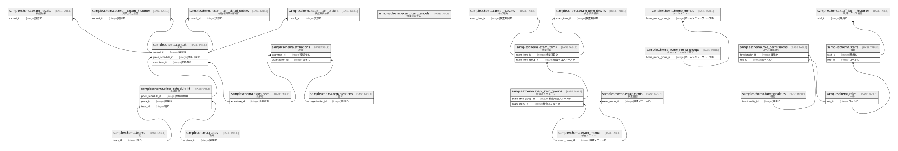

# sampledb

## テーブル一覧

| #  | 名前                                                                                | カラム一覧      | コメント                   | タイプ        |
| -- | --------------------------------------------------------------------------------- | ---------- | ---------------------- | ---------- |
| 1  | [sampleschema.exam_results](sampleschema.exam_results.md)                         | 5          | 検査結果                   | BASE TABLE |
| 2  | [sampleschema.exam_item_cancels](sampleschema.exam_item_cancels.md)               | 4          | 検査項目中止                 | BASE TABLE |
| 3  | [sampleschema.consult_export_histories](sampleschema.consult_export_histories.md) | 3          | 受診_出力履歴                | BASE TABLE |
| 4  | [sampleschema.exam_item_detail_orders](sampleschema.exam_item_detail_orders.md)   | 2          | 検査項目明細依頼               | BASE TABLE |
| 5  | [sampleschema.exam_item_orders](sampleschema.exam_item_orders.md)                 | 2          | 検査項目依頼                 | BASE TABLE |
| 6  | [sampleschema.cancel_reasons](sampleschema.cancel_reasons.md)                     | 4          | 中止理由                   | BASE TABLE |
| 7  | [sampleschema.home_menu_groups](sampleschema.home_menu_groups.md)                 | 3          | ホームメニューグループ            | BASE TABLE |
| 8  | [sampleschema.home_menus](sampleschema.home_menus.md)                             | 4          | ホームメニュー                | BASE TABLE |
| 9  | [sampleschema.exam_item_details](sampleschema.exam_item_details.md)               | 2          | 検査項目明細                 | BASE TABLE |
| 10 | [sampleschema.exam_items](sampleschema.exam_items.md)                             | 5          | 検査項目                   | BASE TABLE |
| 11 | [sampleschema.exam_item_groups](sampleschema.exam_item_groups.md)                 | 4          | 検査項目グループ               | BASE TABLE |
| 12 | [sampleschema.exam_menus](sampleschema.exam_menus.md)                             | 2          | 検査メニュー                 | BASE TABLE |
| 13 | [sampleschema.equipments](sampleschema.equipments.md)                             | 3          | 検査機器                   | BASE TABLE |
| 14 | [sampleschema.place_schedule_id](sampleschema.place_schedule_id.md)               | 5          | 会場日程                   | BASE TABLE |
| 15 | [sampleschema.teams](sampleschema.teams.md)                                       | 2          | 班                      | BASE TABLE |
| 16 | [sampleschema.places](sampleschema.places.md)                                     | 2          | 会場                     | BASE TABLE |
| 17 | [sampleschema.organizations](sampleschema.organizations.md)                       | 3          | 団体                     | BASE TABLE |
| 18 | [sampleschema.consult](sampleschema.consult.md)                                   | 4          | 受診                     | BASE TABLE |
| 19 | [sampleschema.affiliations](sampleschema.affiliations.md)                         | 3          | 所属                     | BASE TABLE |
| 20 | [sampleschema.examinees](sampleschema.examinees.md)                               | 5          | 受診者                    | BASE TABLE |
| 21 | [sampleschema.role_permissions](sampleschema.role_permissions.md)                 | 2          | ロール機能許可                | BASE TABLE |
| 22 | [sampleschema.functionalities](sampleschema.functionalities.md)                   | 2          | 機能                     | BASE TABLE |
| 23 | [sampleschema.staff_login_histories](sampleschema.staff_login_histories.md)       | 4          | 職員ログイン履歴               | BASE TABLE |
| 24 | [sampleschema.roles](sampleschema.roles.md)                                       | 2          | ロール                    | BASE TABLE |
| 25 | [sampleschema.staffs](sampleschema.staffs.md)                                     | 5          | 職員                     | BASE TABLE |

## ER図

---

> Generated by [tbls](https://github.com/k1LoW/tbls)
