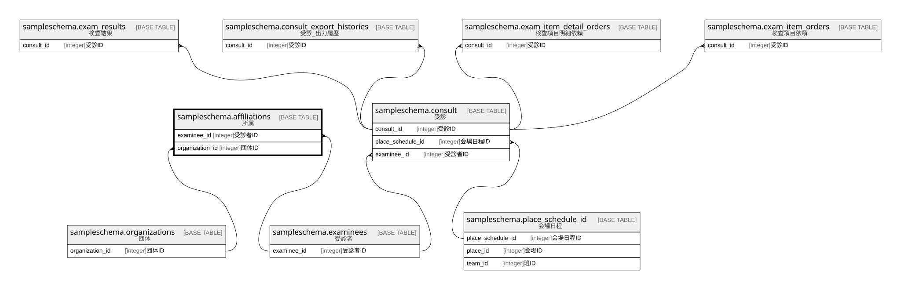

# sampleschema.affiliations

## 概要

所属

## カラム一覧

| # | 名前              | タイプ     | デフォルト値       | Null許容   | 子テーブル      | 親テーブル                                                       | コメント     |
| - | --------------- | ------- | ------------ | -------- | ---------- | ----------------------------------------------------------- | -------- |
| 1 | examinee_id     | integer |              | false    |            | [sampleschema.examinees](sampleschema.examinees.md)         | 受診者ID    |
| 2 | organization_id | integer |              | false    |            | [sampleschema.organizations](sampleschema.organizations.md) | 団体ID     |
| 3 | priority        | integer |              | false    |            |                                                             | 優先度      |

## 制約一覧

| # | 名前               | タイプ         | 定義                                                                                                                        |
| - | ---------------- | ----------- | ------------------------------------------------------------------------------------------------------------------------- |
| 1 | affiliations_fk1 | FOREIGN KEY | FOREIGN KEY (organization_id) REFERENCES sampleschema.organizations(organization_id) ON UPDATE CASCADE ON DELETE RESTRICT |
| 2 | affiliations_pkc | PRIMARY KEY | PRIMARY KEY (examinee_id, organization_id)                                                                                |
| 3 | affiliations_fk2 | FOREIGN KEY | FOREIGN KEY (examinee_id) REFERENCES sampleschema.examinees(examinee_id) ON UPDATE CASCADE ON DELETE RESTRICT             |

## INDEX一覧

| # | 名前               | 定義                                                                                                           |
| - | ---------------- | ------------------------------------------------------------------------------------------------------------ |
| 1 | affiliations_pkc | CREATE UNIQUE INDEX affiliations_pkc ON sampleschema.affiliations USING btree (examinee_id, organization_id) |

## ER図

---

> Generated by [tbls](https://github.com/k1LoW/tbls)
