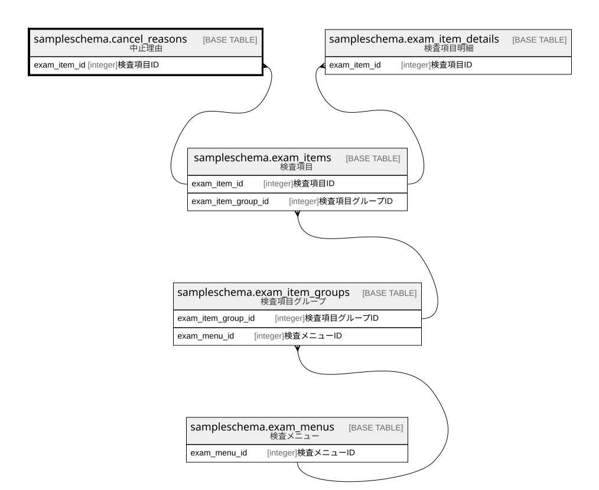

# sampleschema.cancel_reasons

## 概要

中止理由

## カラム一覧

| # | 名前               | タイプ     | デフォルト値       | Null許容   | 子テーブル      | 親テーブル                                                 | コメント       |
| - | ---------------- | ------- | ------------ | -------- | ---------- | ----------------------------------------------------- | ---------- |
| 1 | cancel_reason_id | integer |              | false    |            |                                                       | 中止理由ID     |
| 2 | name             | text    |              | false    |            |                                                       | 中止理由名      |
| 3 | exam_item_id     | integer |              | false    |            | [sampleschema.exam_items](sampleschema.exam_items.md) | 検査項目ID     |
| 4 | order_number     | integer |              | false    |            |                                                       | 表示順        |

## 制約一覧

| # | 名前                 | タイプ         | 定義                                                                                                               |
| - | ------------------ | ----------- | ---------------------------------------------------------------------------------------------------------------- |
| 1 | cancel_reasons_pkc | PRIMARY KEY | PRIMARY KEY (cancel_reason_id)                                                                                   |
| 2 | cancel_reasons_fk1 | FOREIGN KEY | FOREIGN KEY (exam_item_id) REFERENCES sampleschema.exam_items(exam_item_id) ON UPDATE CASCADE ON DELETE RESTRICT |

## INDEX一覧

| # | 名前                 | 定義                                                                                                   |
| - | ------------------ | ---------------------------------------------------------------------------------------------------- |
| 1 | cancel_reasons_pkc | CREATE UNIQUE INDEX cancel_reasons_pkc ON sampleschema.cancel_reasons USING btree (cancel_reason_id) |

## ER図

---

> Generated by [tbls](https://github.com/k1LoW/tbls)
