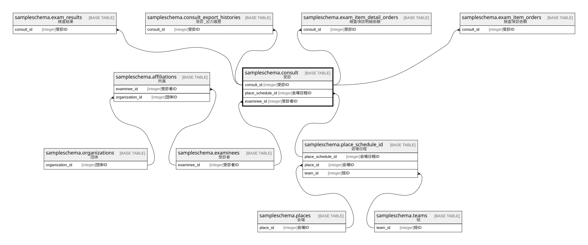

# sampleschema.consult

## 概要

受診

## カラム一覧

| # | 名前                | タイプ     | デフォルト値       | Null許容   | 子テーブル                                                                                                                                                                                                                                                                                         | 親テーブル                                                               | コメント       |
| - | ----------------- | ------- | ------------ | -------- | --------------------------------------------------------------------------------------------------------------------------------------------------------------------------------------------------------------------------------------------------------------------------------------------- | ------------------------------------------------------------------- | ---------- |
| 1 | consult_id        | integer |              | false    | [sampleschema.exam_results](sampleschema.exam_results.md) [sampleschema.consult_export_histories](sampleschema.consult_export_histories.md) [sampleschema.exam_item_detail_orders](sampleschema.exam_item_detail_orders.md) [sampleschema.exam_item_orders](sampleschema.exam_item_orders.md) |                                                                     | 受診ID       |
| 2 | consult_number    | text    |              | false    |                                                                                                                                                                                                                                                                                               |                                                                     | 受診番号       |
| 3 | place_schedule_id | integer |              | false    |                                                                                                                                                                                                                                                                                               | [sampleschema.place_schedule_id](sampleschema.place_schedule_id.md) | 会場日程ID     |
| 4 | examinee_id       | integer |              | false    |                                                                                                                                                                                                                                                                                               | [sampleschema.examinees](sampleschema.examinees.md)                 | 受診者ID      |

## 制約一覧

| # | 名前          | タイプ         | 定義                                                                                                                                |
| - | ----------- | ----------- | --------------------------------------------------------------------------------------------------------------------------------- |
| 1 | consult_fk1 | FOREIGN KEY | FOREIGN KEY (place_schedule_id) REFERENCES sampleschema.place_schedule_id(place_schedule_id) ON UPDATE CASCADE ON DELETE RESTRICT |
| 2 | consult_pkc | PRIMARY KEY | PRIMARY KEY (consult_id)                                                                                                          |
| 3 | consult_fk2 | FOREIGN KEY | FOREIGN KEY (examinee_id) REFERENCES sampleschema.examinees(examinee_id) ON UPDATE CASCADE ON DELETE RESTRICT                     |

## INDEX一覧

| # | 名前          | 定義                                                                               |
| - | ----------- | -------------------------------------------------------------------------------- |
| 1 | consult_pkc | CREATE UNIQUE INDEX consult_pkc ON sampleschema.consult USING btree (consult_id) |

## ER図

---

> Generated by [tbls](https://github.com/k1LoW/tbls)
