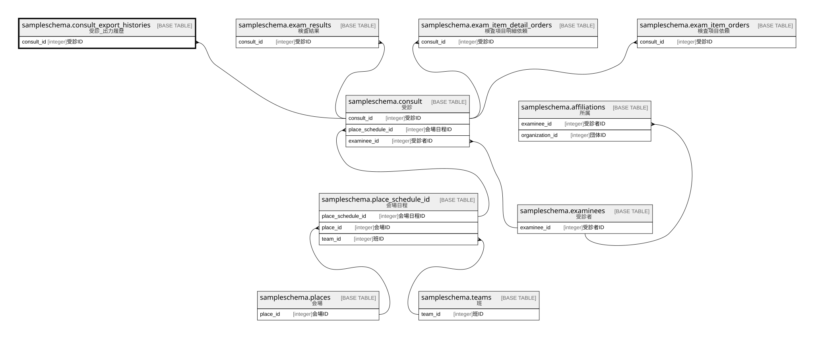

# sampleschema.consult_export_histories

## 概要

受診_出力履歴

## カラム一覧

| # | 名前               | タイプ                      | デフォルト値       | Null許容   | 子テーブル      | 親テーブル                                           | コメント     |
| - | ---------------- | ------------------------ | ------------ | -------- | ---------- | ----------------------------------------------- | -------- |
| 1 | id               | uuid                     |              | false    |            |                                                 | ID       |
| 2 | consult_id       | integer                  |              | false    |            | [sampleschema.consult](sampleschema.consult.md) | 受診ID     |
| 3 | export_timestamp | timestamp with time zone |              | false    |            |                                                 | 出力日時     |

## 制約一覧

| # | 名前                           | タイプ         | 定義                                                                                                        |
| - | ---------------------------- | ----------- | --------------------------------------------------------------------------------------------------------- |
| 1 | consult_export_histories_pkc | PRIMARY KEY | PRIMARY KEY (id)                                                                                          |
| 2 | consult_export_histories_fk1 | FOREIGN KEY | FOREIGN KEY (consult_id) REFERENCES sampleschema.consult(consult_id) ON UPDATE CASCADE ON DELETE RESTRICT |

## INDEX一覧

| # | 名前                           | 定義                                                                                                         |
| - | ---------------------------- | ---------------------------------------------------------------------------------------------------------- |
| 1 | consult_export_histories_pkc | CREATE UNIQUE INDEX consult_export_histories_pkc ON sampleschema.consult_export_histories USING btree (id) |

## ER図

---

> Generated by [tbls](https://github.com/k1LoW/tbls)
