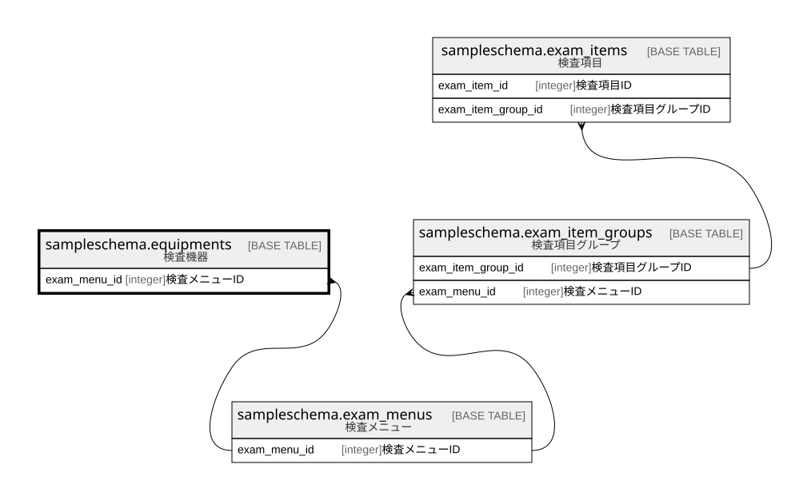

# sampleschema.equipments

## 概要

検査機器

## カラム一覧

| # | 名前           | タイプ     | デフォルト値       | Null許容   | 子テーブル      | 親テーブル                                                 | コメント           |
| - | ------------ | ------- | ------------ | -------- | ---------- | ----------------------------------------------------- | -------------- |
| 1 | equipment_id | integer |              | false    |            |                                                       | 検査機器ID         |
| 2 | name         | text    |              | false    |            |                                                       | 検査機器名          |
| 3 | exam_menu_id | integer |              | false    |            | [sampleschema.exam_menus](sampleschema.exam_menus.md) | 検査メニューID       |

## 制約一覧

| # | 名前             | タイプ         | 定義                                                                                                               |
| - | -------------- | ----------- | ---------------------------------------------------------------------------------------------------------------- |
| 1 | equipments_fk1 | FOREIGN KEY | FOREIGN KEY (exam_menu_id) REFERENCES sampleschema.exam_menus(exam_menu_id) ON UPDATE CASCADE ON DELETE RESTRICT |
| 2 | equipments_pkc | PRIMARY KEY | PRIMARY KEY (equipment_id)                                                                                       |

## INDEX一覧

| # | 名前             | 定義                                                                                       |
| - | -------------- | ---------------------------------------------------------------------------------------- |
| 1 | equipments_pkc | CREATE UNIQUE INDEX equipments_pkc ON sampleschema.equipments USING btree (equipment_id) |

## ER図

---

> Generated by [tbls](https://github.com/k1LoW/tbls)
