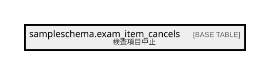

# sampleschema.exam_item_cancels

## 概要

検査項目中止

## カラム一覧

| # | 名前               | タイプ                      | デフォルト値       | Null許容   | 子テーブル      | 親テーブル      | コメント       |
| - | ---------------- | ------------------------ | ------------ | -------- | ---------- | ---------- | ---------- |
| 1 | consult_id       | integer                  |              | false    |            |            | 受診ID       |
| 2 | exam_item_id     | integer                  |              | false    |            |            | 検査項目ID     |
| 3 | cancel_reason_id | integer                  |              | false    |            |            | 中止理由       |
| 4 | cancel_timestamp | timestamp with time zone |              | false    |            |            | 中止日時       |

## 制約一覧

| # | 名前                    | タイプ         | 定義                                     |
| - | --------------------- | ----------- | -------------------------------------- |
| 1 | exam_item_cancels_pkc | PRIMARY KEY | PRIMARY KEY (consult_id, exam_item_id) |

## INDEX一覧

| # | 名前                    | 定義                                                                                                                 |
| - | --------------------- | ------------------------------------------------------------------------------------------------------------------ |
| 1 | exam_item_cancels_pkc | CREATE UNIQUE INDEX exam_item_cancels_pkc ON sampleschema.exam_item_cancels USING btree (consult_id, exam_item_id) |

## ER図

---

> Generated by [tbls](https://github.com/k1LoW/tbls)
