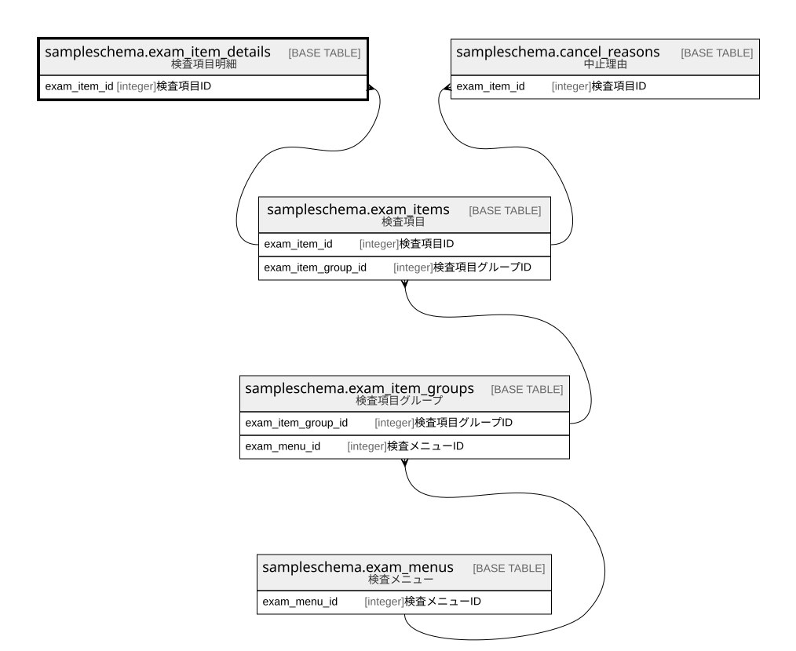

# sampleschema.exam_item_details

## 概要

検査項目明細

## カラム一覧

| # | 名前                   | タイプ     | デフォルト値       | Null許容   | 子テーブル      | 親テーブル                                                 | コメント           |
| - | -------------------- | ------- | ------------ | -------- | ---------- | ----------------------------------------------------- | -------------- |
| 1 | exam_item_id         | integer |              | false    |            | [sampleschema.exam_items](sampleschema.exam_items.md) | 検査項目ID         |
| 2 | exam_item_details_id | integer |              | false    |            |                                                       | 検査項目明細ID       |

## 制約一覧

| # | 名前                    | タイプ         | 定義                                                                                                               |
| - | --------------------- | ----------- | ---------------------------------------------------------------------------------------------------------------- |
| 1 | exam_item_details_pkc | PRIMARY KEY | PRIMARY KEY (exam_item_details_id)                                                                               |
| 2 | exam_item_details_fk1 | FOREIGN KEY | FOREIGN KEY (exam_item_id) REFERENCES sampleschema.exam_items(exam_item_id) ON UPDATE CASCADE ON DELETE RESTRICT |

## INDEX一覧

| # | 名前                    | 定義                                                                                                             |
| - | --------------------- | -------------------------------------------------------------------------------------------------------------- |
| 1 | exam_item_details_pkc | CREATE UNIQUE INDEX exam_item_details_pkc ON sampleschema.exam_item_details USING btree (exam_item_details_id) |

## ER図

---

> Generated by [tbls](https://github.com/k1LoW/tbls)
