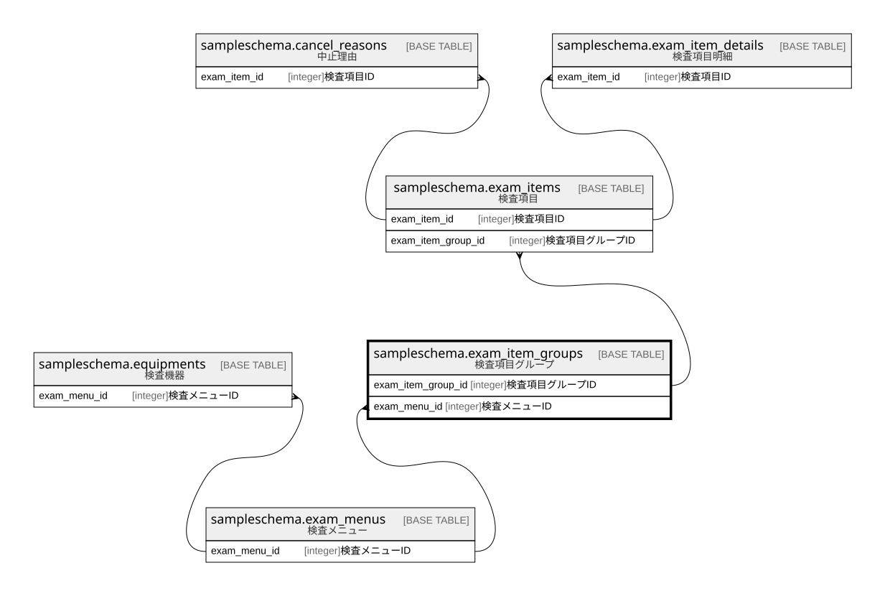

# sampleschema.exam_item_groups

## 概要

検査項目グループ

## カラム一覧

| # | 名前                 | タイプ     | デフォルト値       | Null許容   | 子テーブル                                                 | 親テーブル                                                 | コメント                 |
| - | ------------------ | ------- | ------------ | -------- | ----------------------------------------------------- | ----------------------------------------------------- | -------------------- |
| 1 | exam_item_group_id | integer |              | false    | [sampleschema.exam_items](sampleschema.exam_items.md) |                                                       | 検査項目グループID           |
| 2 | name               | text    |              | false    |                                                       |                                                       | 検査項目グループ名            |
| 3 | exam_menu_id       | integer |              | false    |                                                       | [sampleschema.exam_menus](sampleschema.exam_menus.md) | 検査メニューID             |
| 4 | type               | integer |              | false    |                                                       |                                                       | 検査項目グループ種別           |

## 制約一覧

| # | 名前                   | タイプ         | 定義                                                                                                               |
| - | -------------------- | ----------- | ---------------------------------------------------------------------------------------------------------------- |
| 1 | exam_item_groups_pkc | PRIMARY KEY | PRIMARY KEY (exam_item_group_id)                                                                                 |
| 2 | exam_item_groups_fk1 | FOREIGN KEY | FOREIGN KEY (exam_menu_id) REFERENCES sampleschema.exam_menus(exam_menu_id) ON UPDATE CASCADE ON DELETE RESTRICT |

## INDEX一覧

| # | 名前                   | 定義                                                                                                         |
| - | -------------------- | ---------------------------------------------------------------------------------------------------------- |
| 1 | exam_item_groups_pkc | CREATE UNIQUE INDEX exam_item_groups_pkc ON sampleschema.exam_item_groups USING btree (exam_item_group_id) |

## ER図

---

> Generated by [tbls](https://github.com/k1LoW/tbls)
