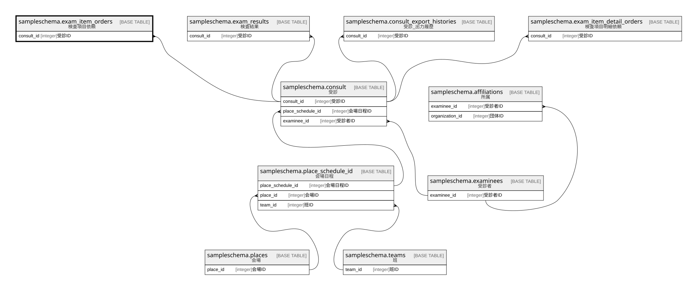

# sampleschema.exam_item_orders

## 概要

検査項目依頼

## カラム一覧

| # | 名前           | タイプ     | デフォルト値       | Null許容   | 子テーブル      | 親テーブル                                           | コメント       |
| - | ------------ | ------- | ------------ | -------- | ---------- | ----------------------------------------------- | ---------- |
| 1 | exam_item_id | integer |              | false    |            |                                                 | 検査項目ID     |
| 2 | consult_id   | integer |              | false    |            | [sampleschema.consult](sampleschema.consult.md) | 受診ID       |

## 制約一覧

| # | 名前                   | タイプ         | 定義                                                                                                        |
| - | -------------------- | ----------- | --------------------------------------------------------------------------------------------------------- |
| 1 | exam_item_orders_pkc | PRIMARY KEY | PRIMARY KEY (consult_id, exam_item_id)                                                                    |
| 2 | exam_item_orders_fk1 | FOREIGN KEY | FOREIGN KEY (consult_id) REFERENCES sampleschema.consult(consult_id) ON UPDATE CASCADE ON DELETE RESTRICT |

## INDEX一覧

| # | 名前                   | 定義                                                                                                               |
| - | -------------------- | ---------------------------------------------------------------------------------------------------------------- |
| 1 | exam_item_orders_pkc | CREATE UNIQUE INDEX exam_item_orders_pkc ON sampleschema.exam_item_orders USING btree (consult_id, exam_item_id) |

## ER図

---

> Generated by [tbls](https://github.com/k1LoW/tbls)
