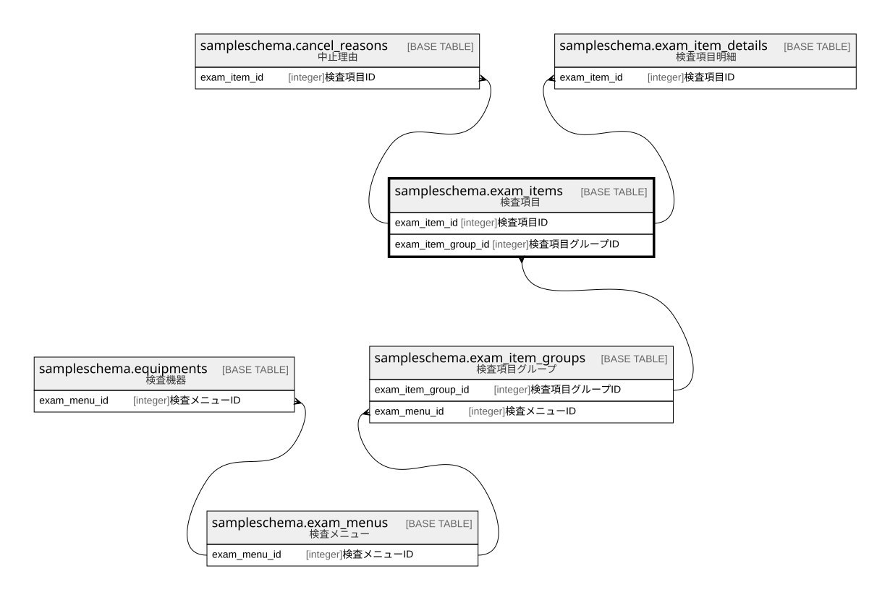

# sampleschema.exam_items

## 概要

検査項目

## カラム一覧

| # | 名前                 | タイプ     | デフォルト値       | Null許容   | 子テーブル                                                                                                                             | 親テーブル                                                             | コメント               |
| - | ------------------ | ------- | ------------ | -------- | --------------------------------------------------------------------------------------------------------------------------------- | ----------------------------------------------------------------- | ------------------ |
| 1 | exam_item_id       | integer |              | false    | [sampleschema.cancel_reasons](sampleschema.cancel_reasons.md) [sampleschema.exam_item_details](sampleschema.exam_item_details.md) |                                                                   | 検査項目ID             |
| 2 | name               | text    |              | false    |                                                                                                                                   |                                                                   | 検査項目名              |
| 3 | exam_item_group_id | integer |              | false    |                                                                                                                                   | [sampleschema.exam_item_groups](sampleschema.exam_item_groups.md) | 検査項目グループID         |
| 4 | selectable_count   | integer |              | false    |                                                                                                                                   |                                                                   | 選択可能数              |
| 5 | unit               | text    |              | false    |                                                                                                                                   |                                                                   | 単位                 |

## 制約一覧

| # | 名前             | タイプ         | 定義                                                                                                                                 |
| - | -------------- | ----------- | ---------------------------------------------------------------------------------------------------------------------------------- |
| 1 | exam_items_pkc | PRIMARY KEY | PRIMARY KEY (exam_item_id)                                                                                                         |
| 2 | exam_items_fk1 | FOREIGN KEY | FOREIGN KEY (exam_item_group_id) REFERENCES sampleschema.exam_item_groups(exam_item_group_id) ON UPDATE CASCADE ON DELETE RESTRICT |

## INDEX一覧

| # | 名前             | 定義                                                                                       |
| - | -------------- | ---------------------------------------------------------------------------------------- |
| 1 | exam_items_pkc | CREATE UNIQUE INDEX exam_items_pkc ON sampleschema.exam_items USING btree (exam_item_id) |

## ER図

---

> Generated by [tbls](https://github.com/k1LoW/tbls)
