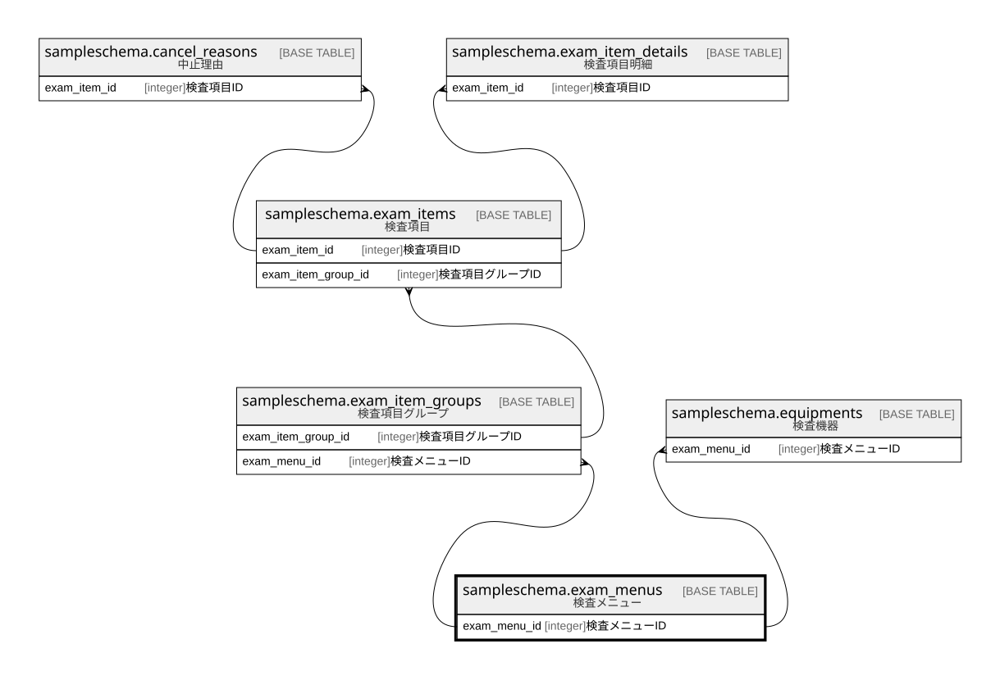

# sampleschema.exam_menus

## 概要

検査メニュー

## カラム一覧

| # | 名前           | タイプ     | デフォルト値       | Null許容   | 子テーブル                                                                                                                   | 親テーブル      | コメント           |
| - | ------------ | ------- | ------------ | -------- | ----------------------------------------------------------------------------------------------------------------------- | ---------- | -------------- |
| 1 | exam_menu_id | integer |              | false    | [sampleschema.exam_item_groups](sampleschema.exam_item_groups.md) [sampleschema.equipments](sampleschema.equipments.md) |            | 検査メニューID       |
| 2 | name         | text    |              | true     |                                                                                                                         |            | 検査メニュー名        |

## 制約一覧

| # | 名前             | タイプ         | 定義                         |
| - | -------------- | ----------- | -------------------------- |
| 1 | exam_menus_pkc | PRIMARY KEY | PRIMARY KEY (exam_menu_id) |

## INDEX一覧

| # | 名前             | 定義                                                                                       |
| - | -------------- | ---------------------------------------------------------------------------------------- |
| 1 | exam_menus_pkc | CREATE UNIQUE INDEX exam_menus_pkc ON sampleschema.exam_menus USING btree (exam_menu_id) |

## ER図

---

> Generated by [tbls](https://github.com/k1LoW/tbls)
