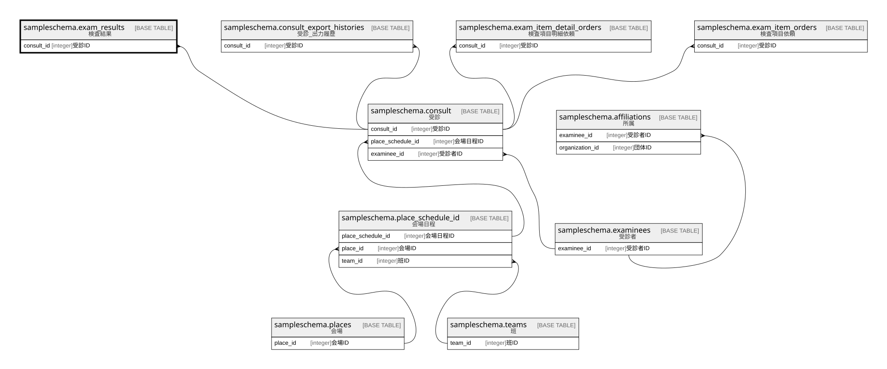

# sampleschema.exam_results

## 概要

検査結果

## カラム一覧

| # | 名前                  | タイプ     | デフォルト値       | Null許容   | 子テーブル      | 親テーブル                                           | コメント           |
| - | ------------------- | ------- | ------------ | -------- | ---------- | ----------------------------------------------- | -------------- |
| 1 | consult_id          | integer |              | false    |            | [sampleschema.consult](sampleschema.consult.md) | 受診ID           |
| 2 | exam_item_id        | integer |              | false    |            |                                                 | 検査項目ID         |
| 3 | exam_item_detail_id | integer |              | false    |            |                                                 | 検査項目明細ID       |
| 4 | numerical_value     | numeric |              | true     |            |                                                 | 定量値            |
| 5 | text_value          | text    |              | true     |            |                                                 | テキスト値          |

## 制約一覧

| # | 名前               | タイプ         | 定義                                                                                                        |
| - | ---------------- | ----------- | --------------------------------------------------------------------------------------------------------- |
| 1 | exam_results_pkc | PRIMARY KEY | PRIMARY KEY (consult_id, exam_item_id, exam_item_detail_id)                                               |
| 2 | exam_results_fk1 | FOREIGN KEY | FOREIGN KEY (consult_id) REFERENCES sampleschema.consult(consult_id) ON UPDATE CASCADE ON DELETE RESTRICT |

## INDEX一覧

| # | 名前               | 定義                                                                                                                            |
| - | ---------------- | ----------------------------------------------------------------------------------------------------------------------------- |
| 1 | exam_results_pkc | CREATE UNIQUE INDEX exam_results_pkc ON sampleschema.exam_results USING btree (consult_id, exam_item_id, exam_item_detail_id) |

## ER図

---

> Generated by [tbls](https://github.com/k1LoW/tbls)
