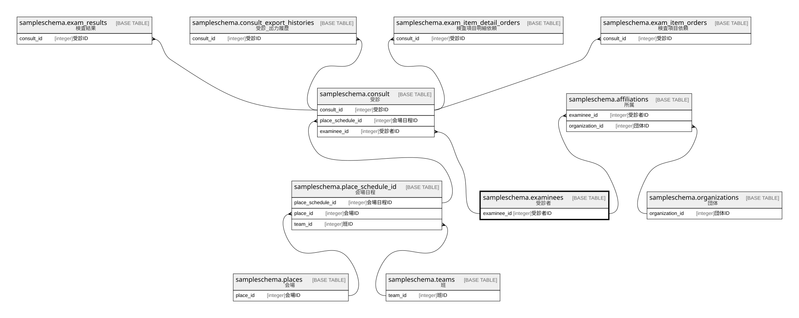

# sampleschema.examinees

## 概要

受診者

## カラム一覧

| # | 名前          | タイプ     | デフォルト値       | Null許容   | 子テーブル                                                                                                     | 親テーブル      | コメント                               |
| - | ----------- | ------- | ------------ | -------- | --------------------------------------------------------------------------------------------------------- | ---------- | ---------------------------------- |
| 1 | examinee_id | integer |              | false    | [sampleschema.consult](sampleschema.consult.md) [sampleschema.affiliations](sampleschema.affiliations.md) |            | 受診者ID                              |
| 2 | name        | text    |              | false    |                                                                                                           |            | 氏名                                 |
| 3 | kana_name   | text    |              | false    |                                                                                                           |            | カナ氏名                               |
| 4 | sex         | integer |              | false    |                                                                                                           |            | 性別:0:不明 1:男性 2:女性 9:その他            |
| 5 | birthdate   | date    |              | false    |                                                                                                           |            | 生年月日                               |

## 制約一覧

| # | 名前            | タイプ         | 定義                        |
| - | ------------- | ----------- | ------------------------- |
| 1 | examinees_pkc | PRIMARY KEY | PRIMARY KEY (examinee_id) |

## INDEX一覧

| # | 名前            | 定義                                                                                    |
| - | ------------- | ------------------------------------------------------------------------------------- |
| 1 | examinees_pkc | CREATE UNIQUE INDEX examinees_pkc ON sampleschema.examinees USING btree (examinee_id) |

## ER図

---

> Generated by [tbls](https://github.com/k1LoW/tbls)
