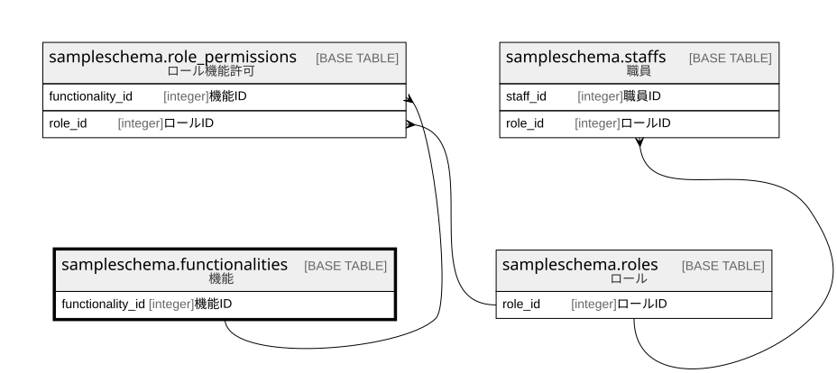

# sampleschema.functionalities

## 概要

機能

## カラム一覧

| # | 名前               | タイプ     | デフォルト値       | Null許容   | 子テーブル                                                             | 親テーブル      | コメント     |
| - | ---------------- | ------- | ------------ | -------- | ----------------------------------------------------------------- | ---------- | -------- |
| 1 | functionality_id | integer |              | false    | [sampleschema.role_permissions](sampleschema.role_permissions.md) |            | 機能ID     |
| 2 | name             | text    |              | false    |                                                                   |            | 機能名      |

## 制約一覧

| # | 名前                  | タイプ         | 定義                             |
| - | ------------------- | ----------- | ------------------------------ |
| 1 | functionalities_pkc | PRIMARY KEY | PRIMARY KEY (functionality_id) |

## INDEX一覧

| # | 名前                  | 定義                                                                                                     |
| - | ------------------- | ------------------------------------------------------------------------------------------------------ |
| 1 | functionalities_pkc | CREATE UNIQUE INDEX functionalities_pkc ON sampleschema.functionalities USING btree (functionality_id) |

## ER図

---

> Generated by [tbls](https://github.com/k1LoW/tbls)
