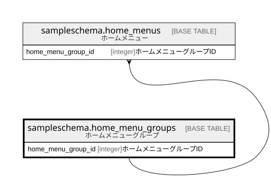

# sampleschema.home_menu_groups

## 概要

ホームメニューグループ

## カラム一覧

| # | 名前                 | タイプ     | デフォルト値       | Null許容   | 子テーブル                                                 | 親テーブル      | コメント                     |
| - | ------------------ | ------- | ------------ | -------- | ----------------------------------------------------- | ---------- | ------------------------ |
| 1 | home_menu_group_id | integer |              | false    | [sampleschema.home_menus](sampleschema.home_menus.md) |            | ホームメニューグループID            |
| 2 | name               | text    |              | false    |                                                       |            | ホームメニューグループ名             |
| 3 | order_number       | integer |              | false    |                                                       |            | 表示順                      |

## 制約一覧

| # | 名前                   | タイプ         | 定義                               |
| - | -------------------- | ----------- | -------------------------------- |
| 1 | home_menu_groups_pkc | PRIMARY KEY | PRIMARY KEY (home_menu_group_id) |

## INDEX一覧

| # | 名前                   | 定義                                                                                                         |
| - | -------------------- | ---------------------------------------------------------------------------------------------------------- |
| 1 | home_menu_groups_pkc | CREATE UNIQUE INDEX home_menu_groups_pkc ON sampleschema.home_menu_groups USING btree (home_menu_group_id) |

## ER図

---

> Generated by [tbls](https://github.com/k1LoW/tbls)
