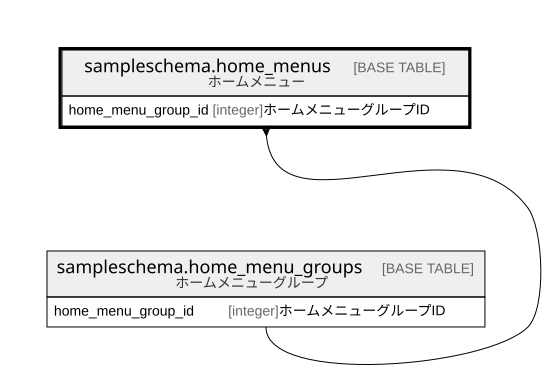

# sampleschema.home_menus

## 概要

ホームメニュー

## カラム一覧

| # | 名前                 | タイプ     | デフォルト値       | Null許容   | 子テーブル      | 親テーブル                                                             | コメント                     |
| - | ------------------ | ------- | ------------ | -------- | ---------- | ----------------------------------------------------------------- | ------------------------ |
| 1 | home_menu_id       | integer |              | false    |            |                                                                   | ホームメニューID                |
| 2 | name               | text    |              | false    |            |                                                                   | ホームメニュー名                 |
| 3 | home_menu_group_id | integer |              | false    |            | [sampleschema.home_menu_groups](sampleschema.home_menu_groups.md) | ホームメニューグループID            |
| 4 | order_number       | integer |              | false    |            |                                                                   | グループ内表示順                 |

## 制約一覧

| # | 名前             | タイプ         | 定義                                                                                                                                 |
| - | -------------- | ----------- | ---------------------------------------------------------------------------------------------------------------------------------- |
| 1 | home_menus_fk1 | FOREIGN KEY | FOREIGN KEY (home_menu_group_id) REFERENCES sampleschema.home_menu_groups(home_menu_group_id) ON UPDATE CASCADE ON DELETE RESTRICT |
| 2 | home_menus_pkc | PRIMARY KEY | PRIMARY KEY (home_menu_id)                                                                                                         |

## INDEX一覧

| # | 名前             | 定義                                                                                       |
| - | -------------- | ---------------------------------------------------------------------------------------- |
| 1 | home_menus_pkc | CREATE UNIQUE INDEX home_menus_pkc ON sampleschema.home_menus USING btree (home_menu_id) |

## ER図

---

> Generated by [tbls](https://github.com/k1LoW/tbls)
