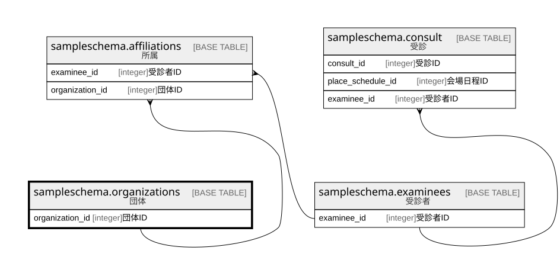

# sampleschema.organizations

## 概要

団体

## カラム一覧

| # | 名前              | タイプ     | デフォルト値       | Null許容   | 子テーブル                                                     | 親テーブル      | コメント     |
| - | --------------- | ------- | ------------ | -------- | --------------------------------------------------------- | ---------- | -------- |
| 1 | organization_id | integer |              | false    | [sampleschema.affiliations](sampleschema.affiliations.md) |            | 団体ID     |
| 2 | name            | text    |              | false    |                                                           |            | 団体名      |
| 3 | order_number    | integer |              | false    |                                                           |            | 表示順      |

## 制約一覧

| # | 名前                | タイプ         | 定義                            |
| - | ----------------- | ----------- | ----------------------------- |
| 1 | organizations_pkc | PRIMARY KEY | PRIMARY KEY (organization_id) |

## INDEX一覧

| # | 名前                | 定義                                                                                                |
| - | ----------------- | ------------------------------------------------------------------------------------------------- |
| 1 | organizations_pkc | CREATE UNIQUE INDEX organizations_pkc ON sampleschema.organizations USING btree (organization_id) |

## ER図

---

> Generated by [tbls](https://github.com/k1LoW/tbls)
