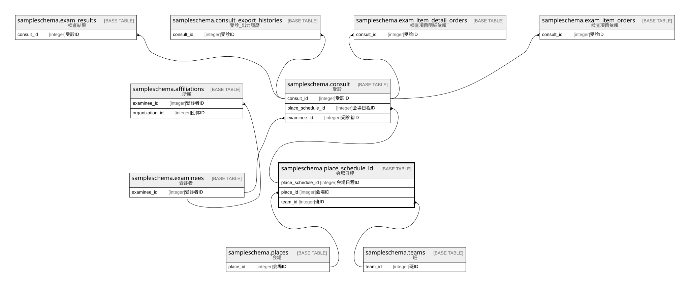

# sampleschema.place_schedule_id

## 概要

会場日程

## カラム一覧

| # | 名前                | タイプ        | デフォルト値       | Null許容   | 子テーブル                                           | 親テーブル                                         | コメント       |
| - | ----------------- | ---------- | ------------ | -------- | ----------------------------------------------- | --------------------------------------------- | ---------- |
| 1 | place_schedule_id | integer    |              | false    | [sampleschema.consult](sampleschema.consult.md) |                                               | 会場日程ID     |
| 2 | place_id          | integer    |              | false    |                                                 | [sampleschema.places](sampleschema.places.md) | 会場ID       |
| 3 | team_id           | integer    |              | false    |                                                 | [sampleschema.teams](sampleschema.teams.md)   | 班ID        |
| 4 | exam_date         | date       |              | false    |                                                 |                                               | 健診日        |
| 5 | start_time        | varchar(4) |              | false    |                                                 |                                               | 開始時刻       |

## 制約一覧

| # | 名前                    | タイプ         | 定義                                                                                                   |
| - | --------------------- | ----------- | ---------------------------------------------------------------------------------------------------- |
| 1 | place_schedule_id_pkc | PRIMARY KEY | PRIMARY KEY (place_schedule_id)                                                                      |
| 2 | place_schedule_id_fk1 | FOREIGN KEY | FOREIGN KEY (team_id) REFERENCES sampleschema.teams(team_id) ON UPDATE CASCADE ON DELETE RESTRICT    |
| 3 | place_schedule_id_fk2 | FOREIGN KEY | FOREIGN KEY (place_id) REFERENCES sampleschema.places(place_id) ON UPDATE CASCADE ON DELETE RESTRICT |

## INDEX一覧

| # | 名前                    | 定義                                                                                                          |
| - | --------------------- | ----------------------------------------------------------------------------------------------------------- |
| 1 | place_schedule_id_pkc | CREATE UNIQUE INDEX place_schedule_id_pkc ON sampleschema.place_schedule_id USING btree (place_schedule_id) |

## ER図

---

> Generated by [tbls](https://github.com/k1LoW/tbls)
