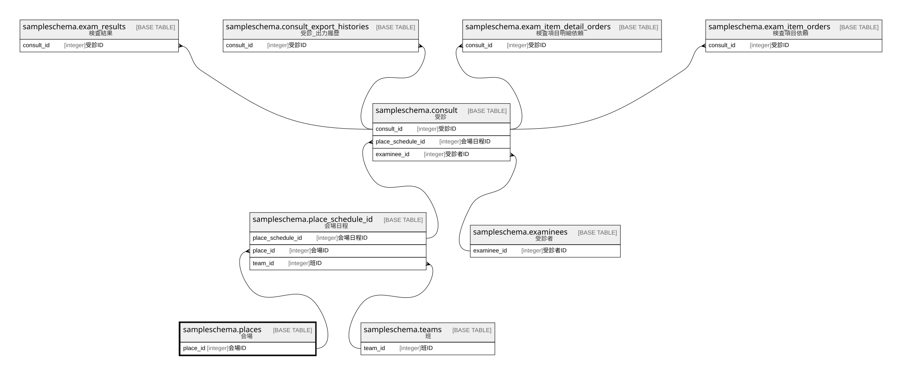

# sampleschema.places

## 概要

会場

## カラム一覧

| # | 名前       | タイプ     | デフォルト値       | Null許容   | 子テーブル                                                               | 親テーブル      | コメント     |
| - | -------- | ------- | ------------ | -------- | ------------------------------------------------------------------- | ---------- | -------- |
| 1 | place_id | integer |              | false    | [sampleschema.place_schedule_id](sampleschema.place_schedule_id.md) |            | 会場ID     |
| 2 | name     | text    |              | true     |                                                                     |            | 会場名      |

## 制約一覧

| # | 名前         | タイプ         | 定義                     |
| - | ---------- | ----------- | ---------------------- |
| 1 | places_pkc | PRIMARY KEY | PRIMARY KEY (place_id) |

## INDEX一覧

| # | 名前         | 定義                                                                           |
| - | ---------- | ---------------------------------------------------------------------------- |
| 1 | places_pkc | CREATE UNIQUE INDEX places_pkc ON sampleschema.places USING btree (place_id) |

## ER図

---

> Generated by [tbls](https://github.com/k1LoW/tbls)
