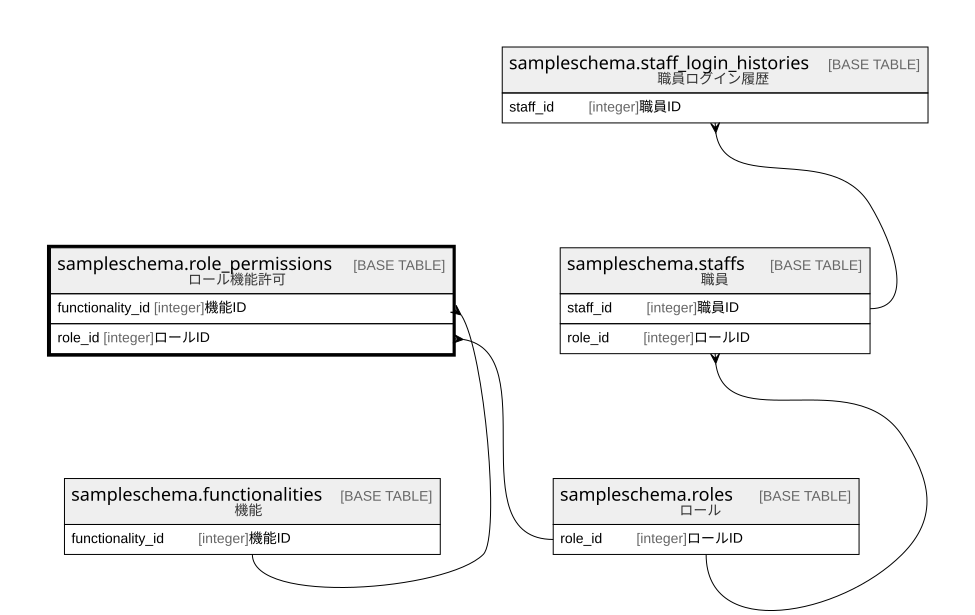

# sampleschema.role_permissions

## 概要

ロール機能許可

## カラム一覧

| # | 名前               | タイプ     | デフォルト値       | Null許容   | 子テーブル      | 親テーブル                                                           | コメント     |
| - | ---------------- | ------- | ------------ | -------- | ---------- | --------------------------------------------------------------- | -------- |
| 1 | functionality_id | integer |              | false    |            | [sampleschema.functionalities](sampleschema.functionalities.md) | 機能ID     |
| 2 | role_id          | integer |              | false    |            | [sampleschema.roles](sampleschema.roles.md)                     | ロールID    |

## 制約一覧

| # | 名前                   | タイプ         | 定義                                                                                                                            |
| - | -------------------- | ----------- | ----------------------------------------------------------------------------------------------------------------------------- |
| 1 | role_permissions_pkc | PRIMARY KEY | PRIMARY KEY (functionality_id, role_id)                                                                                       |
| 2 | role_permissions_fk1 | FOREIGN KEY | FOREIGN KEY (functionality_id) REFERENCES sampleschema.functionalities(functionality_id) ON UPDATE CASCADE ON DELETE RESTRICT |
| 3 | role_permissions_fk2 | FOREIGN KEY | FOREIGN KEY (role_id) REFERENCES sampleschema.roles(role_id) ON UPDATE CASCADE ON DELETE RESTRICT                             |

## INDEX一覧

| # | 名前                   | 定義                                                                                                                |
| - | -------------------- | ----------------------------------------------------------------------------------------------------------------- |
| 1 | role_permissions_pkc | CREATE UNIQUE INDEX role_permissions_pkc ON sampleschema.role_permissions USING btree (functionality_id, role_id) |

## ER図

---

> Generated by [tbls](https://github.com/k1LoW/tbls)
