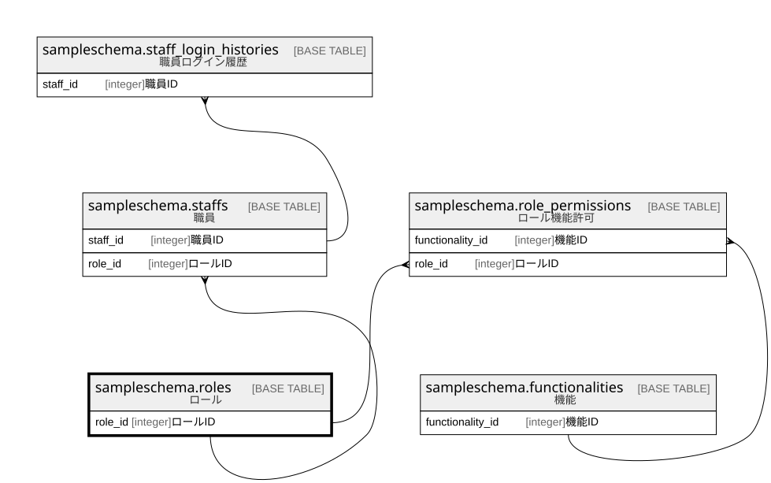

# sampleschema.roles

## 概要

ロール

## カラム一覧

| # | 名前      | タイプ     | デフォルト値       | Null許容   | 子テーブル                                                                                                           | 親テーブル      | コメント     |
| - | ------- | ------- | ------------ | -------- | --------------------------------------------------------------------------------------------------------------- | ---------- | -------- |
| 1 | role_id | integer |              | false    | [sampleschema.role_permissions](sampleschema.role_permissions.md) [sampleschema.staffs](sampleschema.staffs.md) |            | ロールID    |
| 2 | name    | text    |              | false    |                                                                                                                 |            | ロール名     |

## 制約一覧

| # | 名前        | タイプ         | 定義                    |
| - | --------- | ----------- | --------------------- |
| 1 | roles_pkc | PRIMARY KEY | PRIMARY KEY (role_id) |

## INDEX一覧

| # | 名前        | 定義                                                                        |
| - | --------- | ------------------------------------------------------------------------- |
| 1 | roles_pkc | CREATE UNIQUE INDEX roles_pkc ON sampleschema.roles USING btree (role_id) |

## ER図

---

> Generated by [tbls](https://github.com/k1LoW/tbls)
