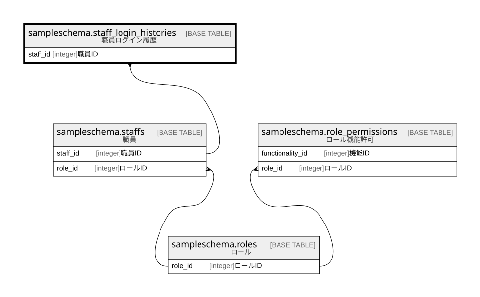

# sampleschema.staff_login_histories

## 概要

職員ログイン履歴

## カラム一覧

| # | 名前              | タイプ                      | デフォルト値       | Null許容   | 子テーブル      | 親テーブル                                         | コメント               |
| - | --------------- | ------------------------ | ------------ | -------- | ---------- | --------------------------------------------- | ------------------ |
| 1 | id              | uuid                     |              | false    |            |                                               | ID                 |
| 2 | staff_id        | integer                  |              | false    |            | [sampleschema.staffs](sampleschema.staffs.md) | 職員ID               |
| 3 | login_timestamp | timestamp with time zone |              | false    |            |                                               | ログイン試行日時           |
| 4 | login_success   | boolean                  |              | false    |            |                                               | ログイン成功フラグ          |

## 制約一覧

| # | 名前                        | タイプ         | 定義                                                                                                   |
| - | ------------------------- | ----------- | ---------------------------------------------------------------------------------------------------- |
| 1 | staff_login_histories_pkc | PRIMARY KEY | PRIMARY KEY (id)                                                                                     |
| 2 | staff_login_histories_fk1 | FOREIGN KEY | FOREIGN KEY (staff_id) REFERENCES sampleschema.staffs(staff_id) ON UPDATE CASCADE ON DELETE RESTRICT |

## INDEX一覧

| # | 名前                        | 定義                                                                                                   |
| - | ------------------------- | ---------------------------------------------------------------------------------------------------- |
| 1 | staff_login_histories_pkc | CREATE UNIQUE INDEX staff_login_histories_pkc ON sampleschema.staff_login_histories USING btree (id) |

## ER図

---

> Generated by [tbls](https://github.com/k1LoW/tbls)
