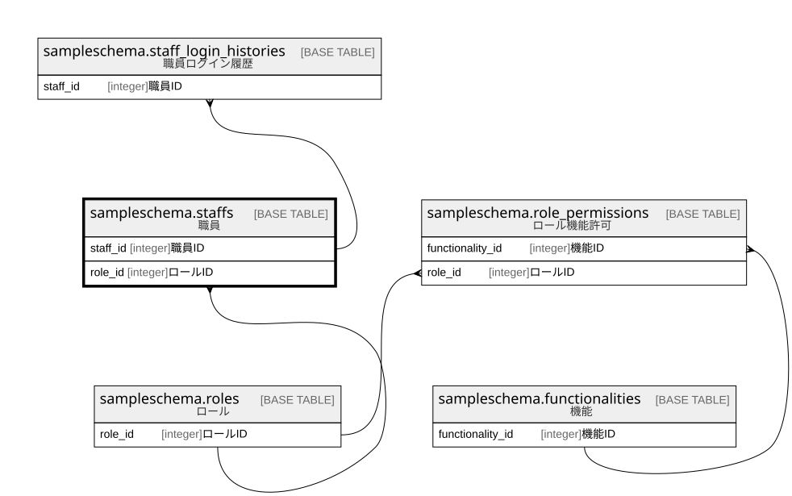

# sampleschema.staffs

## 概要

職員

## カラム一覧

| # | 名前             | タイプ     | デフォルト値       | Null許容   | 子テーブル                                                                       | 親テーブル                                       | コメント               |
| - | -------------- | ------- | ------------ | -------- | --------------------------------------------------------------------------- | ------------------------------------------- | ------------------ |
| 1 | staff_id       | integer |              | false    | [sampleschema.staff_login_histories](sampleschema.staff_login_histories.md) |                                             | 職員ID               |
| 2 | name           | text    |              | false    |                                                                             |                                             | 職員名                |
| 3 | password_hash  | bytea   |              | false    |                                                                             |                                             | パスワードハッシュ          |
| 4 | password_salt  | bytea   |              | false    |                                                                             |                                             | パスワードソルト           |
| 5 | role_id        | integer |              | false    |                                                                             | [sampleschema.roles](sampleschema.roles.md) | ロールID              |

## 制約一覧

| # | 名前         | タイプ         | 定義                                                                                                |
| - | ---------- | ----------- | ------------------------------------------------------------------------------------------------- |
| 1 | staffs_fk1 | FOREIGN KEY | FOREIGN KEY (role_id) REFERENCES sampleschema.roles(role_id) ON UPDATE CASCADE ON DELETE RESTRICT |
| 2 | staffs_pkc | PRIMARY KEY | PRIMARY KEY (staff_id)                                                                            |

## INDEX一覧

| # | 名前         | 定義                                                                           |
| - | ---------- | ---------------------------------------------------------------------------- |
| 1 | staffs_pkc | CREATE UNIQUE INDEX staffs_pkc ON sampleschema.staffs USING btree (staff_id) |

## ER図

---

> Generated by [tbls](https://github.com/k1LoW/tbls)
