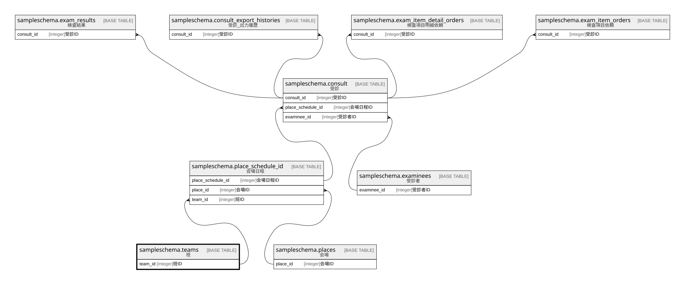

# sampleschema.teams

## 概要

班

## カラム一覧

| # | 名前      | タイプ     | デフォルト値       | Null許容   | 子テーブル                                                               | 親テーブル      | コメント     |
| - | ------- | ------- | ------------ | -------- | ------------------------------------------------------------------- | ---------- | -------- |
| 1 | team_id | integer |              | false    | [sampleschema.place_schedule_id](sampleschema.place_schedule_id.md) |            | 班ID      |
| 2 | name    | text    |              | false    |                                                                     |            | 班名       |

## 制約一覧

| # | 名前        | タイプ         | 定義                    |
| - | --------- | ----------- | --------------------- |
| 1 | teams_pkc | PRIMARY KEY | PRIMARY KEY (team_id) |

## INDEX一覧

| # | 名前        | 定義                                                                        |
| - | --------- | ------------------------------------------------------------------------- |
| 1 | teams_pkc | CREATE UNIQUE INDEX teams_pkc ON sampleschema.teams USING btree (team_id) |

## ER図

---

> Generated by [tbls](https://github.com/k1LoW/tbls)
