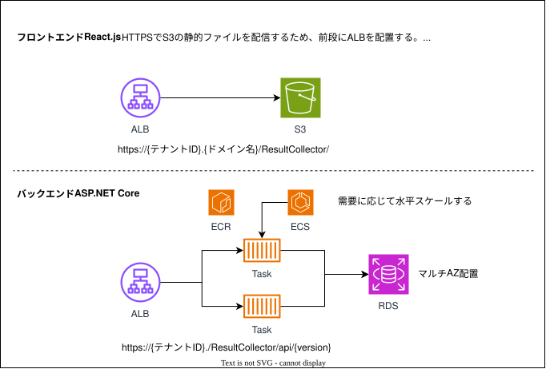

= システムアーキテクチャ

== 前提

* 本システムはAWS上で稼働する
* マルチテナント型のWebアプリケーションを主とする
* データベースは1つのインスタンスで、インスタンス内をテナント毎に分離する
* フロントエンドとバックエンドをRESTfulなWebAPIで分離したSPA構成

== システム構成

インフラ構成図は別途管理する。ここに記載する内容はアプリケーションエンジニアのためのシステム構成とする。

=== 概要図

=== フロントエンド

* React(Remix)で実装する
* ビルド成果物をAmazon S3で静的ファイルとして配信する
* Webサーバが不要のため、コストや可用性でメリットがある

=== バックエンド（WebAPI）

* ASP.NET Coreで実装する
* Dockerコンテナ上で動作させるため、以下を考慮すること
** 設定ファイルを持たない
** ログ系ははテキストファイルではなく、標準出力や標準エラー出力に出力する
* コンテナのマネージドサービスであるECS on Fargateで実行する
* ステートレスな構成でセッションを利用しないため、オートスケーリング（水平スケール）を利用可能である

=== データベース

* PostgreSQLで実装する
* RDS for PostgreSQLで実行する
** インスタンス
** マルチAZでレプリケーション
** テナントごとにインスタンスを分離せず、WELLSHIPとして1インスタンスを持つ
* データベース単位でテナント分離する（スキーマより1つ上の概念）
