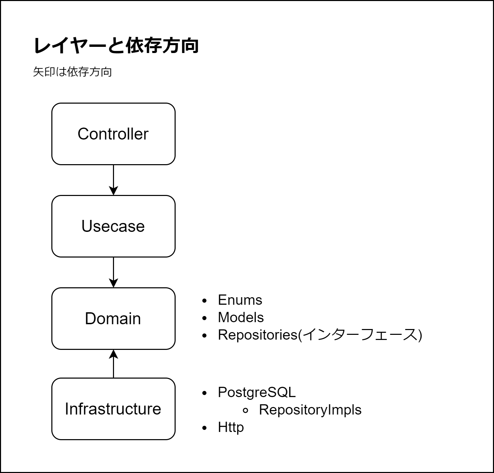
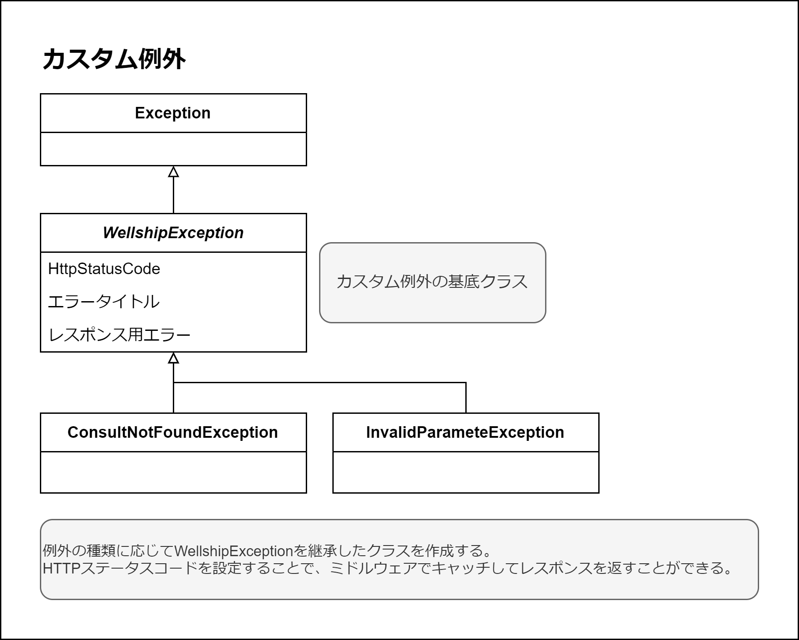
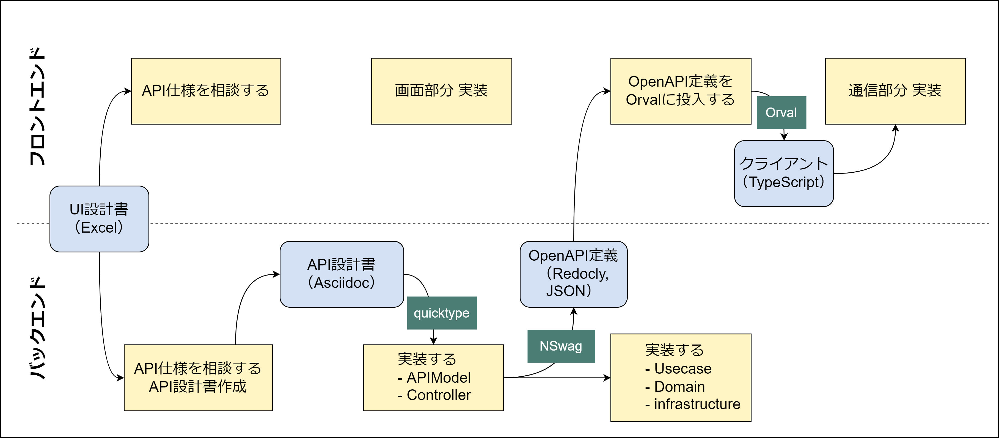

= バックエンド

== プロジェクト構成

[source]
.
└── Backend/
    ├── Wellship.sln
    ├── src/
    │   ├── Wellship.APIModels/
    │   │   ├── Wellship.APIModels.csproj
    │   │   └── ResultCollector/
    │   │       ├── Requests
    │   │       └── Response
    │   ├── Wellship.Core/
    │   │   ├── Wellship.Core.csproj
    │   │   └── Exception
    │   └── Wellship.WebAPI/
    │       ├── Wellship.WebAPI.csproj
    │       └── ResultCollector/
    │           ├── Controllers
    │           ├── Usecases
    │           ├── Domain/
    │           │   ├── Models
    │           │   ├── Enums
    │           │   └── Repositories
    │           ├── Infrastructure/
    │           │   ├── PostgreSQL/
    │           │   │   └── RepositoryImpls
    │           │   └── Http
    │           ├── Utilities
    │           └── Middlewares
    └── tests/
        ├── Wellship.Core.Tests/
        │   └── Wellship.Core.Tests.csproj
        └── Wellship.WebAPI.Tests/
            └── Wellship.WebAPI.Tests.csproj/
                └── ResultCollector/
                    ├── Usecases
                    └── Domain

プロダクトコードとテストコードで大きく分割する。メインはWellship.WebAPIに実装するが、APIモデルや例外は他のアプリ（CLIアプリ）から参照することもあるため、プロジェクトを分離して参照可能にする。第二弾以降ではWELLSHIP共通機能となるものが出てくるが、初期開発時に分割するのは難しいため「結果収集（ResultCollector）」配下に配置する。

[cols="1,3,8" options="header"]
|===

|区分|プロジェクト名 | 説明
.3+^.^|src
|Wellship.APIModels
|APIモデル。例えばCLIツールから参照する場合があるので切り出す。
|Wellship.Core
| 例外など共通的な部分
|Wellship.WebAPI
| WebAPI本体

.2+^.^|tests
|Wellship.Core.Tests
| Coreのユニットテスト
|Wellship.WebAPI.Tests
| WebAPIのユニットテスト

|===

== 名前空間

Microsoftのガイドラインを参考に以下の名前空間とする。

* `Ryobi.Wellship.{csproj名}.{ディレクトリ構成に従う}`

https://learn.microsoft.com/ja-jp/dotnet/standard/design-guidelines/names-of-namespaces[名前空間の名前 - Framework Design Guidelines | Microsoft Learn]

== ライブラリ

[cols="4,6" options="header"]
|===
|ライブラリ | 機能

| Dapper| マイクロORM
| Npgsql| PostgreSQLとの接続
| Microsoft.AspNetCore.Mvc.Versioning| APIのバージョニング
| nlog.Web.AspNetCore| ロギング
| nswag.AspNetCore| WebAPI仕様書の自動生成
| coverlet.collector| テストカバレッジ収集
| fluentAssertions| 単体テストの記述方法拡張
| Microsoft.NET.Test.Sdk| 単体テスト
| Moq| 単体テストのモッキング
| xunit.runner.visualstudio| 単体テスト
| xunit| 単体テスト

|===

== レイヤー

責務に応じてレイヤーを分離して、依存関係をコントロールする。

[cols="2,10" options="header"]
|=== 
| レイヤー名 | 説明
| Controller
| WebAPIの入口として、HTTPリクエストを受け付ける役割を果たす。URIやHTTPメソッドなどを定義する。具体的な処理は行わず、Usecaseを呼び出す。UsecaseのメソッドにはAPIのリクエストモデルが渡される。
| Usecase
| ビジネスロジックを含む中核的な部分であり、アプリケーションのユースケースを実装する。コントローラーからのリクエストを受け取り、ドメインモデルを利用して処理を実行する。データの永続化や外部サービスへのアクセスは行わない。Usecaseのメソッドでは、受け取ったリクエストモデルを解析・バリデーションし、ドメインモデルやエンティティに変換してドメインのルールを適用する。
| Domain
| ビジネスドメインの核となるルールや概念を表現する。エンティティ、値オブジェクトを定義し（本プロジェクトではModelsに格納）、ビジネスロジックをカプセル化する。これにより、アプリケーションのメインロジックを明確化し、再利用性を高める。また、ドメインイベントも定義することで、ドメイン内での重要な操作や状態変化を監視・通知することができる。
| Infrastructure
| データベースや外部サービスなど、アプリケーションのインフラストラクチャ層を表す。データの永続化や外部サービスへのアクセスを行う。PostgreSQLやHTTPなどの実際のデータソースに対するアクセスを実装するため、リポジトリやAPIクライアントの具体的な実装クラスを含むことができる。この層はデータアクセスの詳細を隠蔽し、ドメイン層によるビジネスルールの実行をサポートする。
|===

== エラーハンドリング

ASP.NET Coreのミドルウェアでキャッチするため、個別のメソッド内にTry-Catchを記述しない。

System.Exceptionをそのまま利用するのはNG。
例外の種類に応じて、抽象クラスであるWellshipExceptionを継承したカスタム例外を定義する。

HTTPステータスコードを設定することで、Usecaseのメソッド内で例外送出した際、クライアント側に設定したHTTPステータスコードが伝わる。

== データベースアクセス

=== 接続方法

PostgreSQLにはNpgsqlを使用してアクセスする。

SQLと.NETオブジェクト間のマッピングにはマイクロORMであるDapperを使用する。
EFCoreの場合とは異なり、クエリビルダ機能はないため開発者自身でSQLを記述する。

各リポジトリは、接続共通部品であるIDbConnectionProviderをコンストラクタからDIする。

=== リトライ

アプリからPostgreSQLへの接続が瞬断した場合でも自動復旧できるようにIDbConnectionProviderにリトライ処理を入れる。リトライ処理はPollyというライブラリを使用する。

== ロギング

バックエンド（WebAPI、外部インターフェース）のログ記録について記載する。

=== ログの種類と形式

==== 例外ログ

アプリケーション内で例外が送出された際、例外ミドルウェアで補足してログとして記録する。

システム例外についてはERRORとして、NLog経由で標準出力に出力する。

==== カスタムログ

処理の進行状況や警告などを任意のタイミングで記録する。
すべてデータベースに記録して、ERROR以上の場合はNLog経由で標準出力にも出力する。

=== ログの保存先

==== データベース

テナント別のデータベースにある `app_logs` テーブルに保存する。

[cols="2,3,2,3,2", options="header"]
|===
| 物理名| 論理名 | 型 | デフォルト値 | 制約

| id
| ID
| uuid
| gen_random_uuid()
| NOT NULL, PRIMARY KEY

| log_level
| ログレベル
| varchar(5)
|
| NOT NULL

| message
| メッセージ
| text
|
| NOT NULL

| details
| 付加情報
| jsonb
|
|

| created_at
| 作成日時
| timestamp with time zone
| CURRENT_TIMESTAMP
| NOT NULL

| created_by
| 作成者
| text
|
| NOT NULL
|===

[source,sql]
----
CREATE TABLE app_logs (
  id uuid DEFAULT gen_random_uuid() NOT NULL
  , log_level varchar(5) NOT NULL
  , message text NOT NULL
  , details jsonb
  , created_at timestamp with time zone DEFAULT CURRENT_TIMESTAMP NOT NULL
  , created_by text NOT NULL
  , CONSTRAINT app_logs_PKC PRIMARY KEY (id)
);
----

==== 標準出力

構造化ログとしてJSON形式で出力する。

以下は出力の例。

[source,json]
----
{ "date": "2025-02-04 16:44:10.8429", "level": "ERROR", "message": "○○処理に失敗しました。"}
----

Amazon ECSから標準出力すると、CloudWatchに転送されるためマネジメントコンソールから確認する。

=== ログレベル

アプリケーション内部のログレベルは `Microsoft.Extensions.Logging.LogLevel` を使用するが、標準出力とカスタムログのログレベルは `NLog` のログレベル文字列として出力する。
以下に対応表を示す。

[cols="1,1,3a,3a", options="header"]
|===
| Microsoft
| NLog
| NLog→CloudWatch→ 通知
| カスタムログ（DB）→app_logs

| None
| Off
| 使用しない
| 使用しない

| Critical
| Fatal
| フレームワークから
| 使用しない

| Error
| Error
|* カスタムログサービス
 * システム例外
| カスタムログサービス

| Warning
| Warn
| ※カスタム例外
| カスタムログサービス

| Information
| Info
| 原則、使用しない
| カスタムログサービス

| Debug
| Debug
| 開発時のみ
| 開発時のみ

| Trace
| Trace
| 開発時のみ
| 開発時のみ
|===

AWS上ではError以上のログに限り、NLog経由で出力する。
カスタムログサービスはErrorログ以上に限らず保存する。

=== カスタムログサービスの設計

カスタムログサービスのinterfaceを定義して、実装するclassを作成する。
ログを書き込むメソッドをログレベルごとに3種類用意する。

メッセージ以外に付加的な情報を書き込みたい場合は、details（ `<string, object>` 型の辞書）に値をセットする。detailsがある場合は、app_logsテーブルのdetailsカラムにJSON文字列化して保存する。

[mermaid,ICustomLoggingService-cd,png]
----
classDiagram
class ICustomLoggingService {
    <<interface>>
    +Task LogInfoAsync(string message, Dictionary~string, object~? details = null)
    +Task LogWarnAsync(string message, Dictionary~string, object~? details = null)
    +Task LogErrorAsync(string message, Dictionary~string, object~? details = null)
}

class CustomLoggingService {
    +ILogger<CustomLoggingService> _logger
    +ITenantProvider _tenantProvider
    +ILogRepository _logRepository
    +CustomLoggingService(ILogger<CustomLoggingService> logger, ITenantProvider tenantProvider, ILogRepository logRepository)
    +Task LogInfoAsync(string message, Dictionary~string, object~? details = null)
    +Task LogWarnAsync(string message, Dictionary~string, object~? details = null)
    +Task LogErrorAsync(string message, Dictionary~string, object~? details = null)
    -Task LogAsync(LogLevel level, string message, Dictionary~string, object~? details)
}

ICustomLoggingService <|.. CustomLoggingService
----

=== ロギングサービスの組み込み方法

呼び出したいクラスに `ICustomLoggingService` をコンストラクタから注入する。

書き込みたいログレベルに応じて、3種類の公開メソッドを呼び分ける。

* LogInfoAsync(message, details)
* LogWarnAsync(message, details)
* LogErrorAsync(message, details)

[mermaid,CustomLoggingService-sd,png]
----
sequenceDiagram
    participant Client as 呼び出し側
    participant CustomLoggingService
    participant LogRepository
    participant NLog
    
    rect rgb(216, 245, 255)
        Client->>CustomLoggingService: LogInfoAsync(message, details)
        CustomLoggingService->>LogRepository: WriteLogAsync(log)
    end

    rect rgb(248, 226, 191)
        Client->>CustomLoggingService: LogWarnAsync(message, details)
        CustomLoggingService->>LogRepository: WriteLogAsync(log)
    end

    rect rgb(253, 228, 232)
        Client->>CustomLoggingService: LogErrorAsync(message, details)
        CustomLoggingService->>LogRepository: WriteLogAsync(log)
        CustomLoggingService->>NLog: LogError(message)
    end
----

== 効率的なバックエンド開発のために

各種ツールを用いて、機械的な作業の省力化を目指す。

=== 全体の流れ

. API設計書を作成する
. APIModelとControllerを実装する
. RedoclyからOpenAPI仕様を出力する
. https://orval.dev/[Orval] でフロントエンド側のクライアントコードを生成する

本来のスキーマ駆動開発はOpenAPI仕様をYAMLで記述してバックエンド・フロントエンド両方のコードを生成するが、YAMLによる仕様記述の学習コストが高いため、 https://github.com/RicoSuter/NSwag[NSwag] を用いてバックエンドの実装からOpenAPI仕様を出力する方式を採用する。

=== サンプルのJSONからC#のClassを生成する

API設計書に記載したリクエストおよびレスポンスのJSON文字列をC#のClassに変換する必要がある。
手動で変換すると時間がかかるため、 https://quicktype.io/[quicktype] というツールを使用する。
CLIツールやVSCode拡張機能もあるが、最も簡単に使えるのは https://app.quicktype.io/[Webアプリ] である。

JSON文字列を貼り付けると自動でC#のコードが生成される。

なお、Webアプリであるがクライアント側で変換処理をしておりサーバ側にデータが送信されることはない。

[quote, 'https://github.com/glideapps/quicktype[GitHub-glideapps/quicktype]']
____
app.quicktype.io is the most powerful and complete UI. The web app also works offline and doesn't send your sample data over the Internet, so paste away!
____

=== ユニットテストを記述する

以下のレイヤーの各メソッドについてユニットテスト（単体テスト）を整備する。

* Domain
** Models
* Usecase
** リポジトリに依存する部分はMoqを使ってモッキングする

生成AI（LLM）を活用して、プロダクトコードに対するテストコードの生成を省力化する。
業務コードのためプライベートLLMを利用する必要がある。ビジネス戦略本部が提供している https://azurechat.rsoa.ryobi.co.jp/chat[AzureChat]を利用することが望ましい。

以下にプロンプトの例を示すので、参考にされたい。

[source,markdown]
----

## 前提

- あなたはシニアプログラマとしてテストコードの整備を支援してください

## 指示

- ASP.NET Core 8でxUnitを使います。
- テストコードは3Aパターンで書きます。
  - Arrange、Act、Assertをコメントしてください。
- Fluent Assertionsを使います。Assertは xxx.Should().BeTrue()のようにFluent Assertionsを生かした流暢な書き方にしてください。
テストメソッド名は「簡潔な日本語で」命名してください。開発者以外にも分かるようにふるまいを表す名前にします。
呼び出すプロダクションコードのメソッド名は不要です。
- テストコードはプロダクションコードの名前空間やクラス名と対比してテストと分かるように付けます

## 入力

プロダクションコード

## 出力

テストコード
---
それでははじめます。

----

=== WebAPI一覧からC#のクラスを作成する

WebAPI一覧に以下の情報がある。

* HTTPメソッド
* URI
* 概要説明

WebAPI一覧をインプットにしてControllerのスケルトンができると便利である。

表形式のデータを一足飛びにC#のコードにすると修正があった場合の手間が大きい。そこでプレーンテキストでUMLのクラス図を出力させて中間生成物とするのがよい。

. WebAPI一覧を作成する
. WebAPI一覧をAzureChatに投入してPlantUMLまたはMermaid.jsのクラス図を出力させる
. 出力させたクラス図を手動で調整する
. 調整したクラス図（プレーンテキスト）をAzureChatに投入しC#のControllerを出力させる
