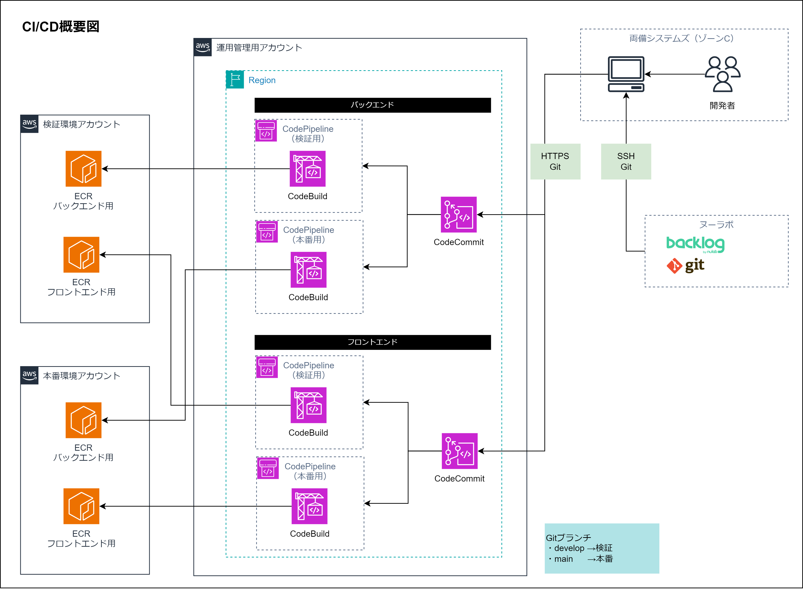

= CI/CDパイプライン

== 概要

=== CI/CDパイプラインの目的と重要性

CI/CDパイプラインは、ソフトウェアの開発からデプロイまでのプロセスを自動化し、効率化する仕組みです。 +
これにより、コードの変更を迅速かつ安全に検証/本番環境に反映させることができます。

== 構成図

== 使用するAWSサービス

=== CodeCommit

CodeCommitは、AWSのソースコード管理サービスです。Gitリポジトリをホストし、コードをバージョン管理します。

=== CodeBuild

CodeBuildは、ソースコードのビルドとテストを自動化するサービスです。継続的インテグレーションをサポートします。 +
ビルドプロジェクトという単位で管理します。ビルド時のコマンドや順序はbuildspec.ymlに記載します。

=== ECR

ECR（Elastic Container Registry）は、Dockerコンテナイメージを保存、管理するサービスです。

=== ECS

ECS（Elastic Container Service）は、Dockerコンテナを実行、停止、管理するサービスです。 +
スケーラブルで高可用性のコンテナ化アプリケーションをデプロイできます。

== 環境

.AWSアカウントと使用サービス
[cols="2,6a", options="header"]
|===
| AWSアカウント | 使用サービス

| 検証環境
| 
* ECS（Dockerコンテナ実行）
* ECR（Dockerコンテナイメージ保管）
| 本番環境
| 
* ECS（Dockerコンテナ実行）
* ECR（Dockerコンテナイメージ保管）
| 運用管理
| 
* CodeCommit（ソースコード管理）
* CodeBuild（ビルド実行）
|===

== リポジトリ構成

Backlog GitとCodeCommitはリポジトリの構造が異なります。 +
ビルド環境の技術的制約により、CodeCommitはフロントエンドとバックエンドでリポジトリを分けています。

.BacklogとCodeCommitのリポジトリ対比
[options="header"]
|===
| Backlogリポジトリ | CodeCommitリポジトリ
.2+.^| WELLSHIP | wellship-ops-codecommit-ecr-frontend
                 | wellship-ops-codecommit-ecr
|===

=== Backlog Git

Backlogはモノレポ構成であり `Frontend` 、 `Backend` はルート配下のフォルダで分けています。

[source]
WELLSHIP/
├── compose.yml
├── README.md
├── Frontend
├── Backend
├── Documents
├── Database
├── MobileApp
└── Tools

=== AWS CodeCommit

フロントエンドとバックエンドでそれぞれGitリポジトリがあります。 +
Backlog Gitのリポジトリ内を単純に分割しているだけで、`Frontend` と `Backend` フォルダ内部は同じです。

[source]
wellship-ops-codecommit-ecr-frontend/
├── Frontend
└── buildspec.yml

[source]
wellship-ops-codecommit-ecr/
├── Backend
└── buildspec.yml

== パイプライン

CodeBuildビルドプロジェクトの流れをシーケンス図に示します。

=== フロントエンドの流れ

[mermaid,FrontendCodeBuildSeq,png,scale=3,pdfwidth=100%]
....
sequenceDiagram
    autonumber
    participant CodeBuild as CodeBuild
    participant ECR as ECR
    participant ECS as ECS

    Note over CodeBuild, ECR: インストール
    CodeBuild->>CodeBuild: Node.js 22.9.0をインストール

    Note over CodeBuild, ECR: ビルド前
    CodeBuild->>ECR: 一時的な認証情報を取得
    CodeBuild->>ECR: 取得した認証情報を使用してログイン
    CodeBuild->>CodeBuild: コミットIDを取得してイメージタグに設定

    Note over CodeBuild, ECR: ビルド
    CodeBuild->>CodeBuild: Dockerイメージを作成

    Note over CodeBuild, ECS: ビルド後
    CodeBuild->>ECR: 作成したDockerイメージをプッシュ
    CodeBuild->>ECS: タスク定義を更新
    CodeBuild->>ECS: 更新したタスクをデプロイ
....

=== バックエンドの流れ

[mermaid,BackendCodeBuildSeq,png,scale=3,pdfwidth=100%]
....
sequenceDiagram
    autonumber
    participant CodeBuild as CodeBuild
    participant ECR as ECR
    participant ECS as ECS

    Note over CodeBuild, ECS: インストール
    CodeBuild->>CodeBuild: .NET 8.0 SDKをインストール

    Note over CodeBuild, ECS: ビルド前
    CodeBuild->>ECR: 一時的な認証情報を取得
    CodeBuild->>ECR: 取得した認証情報を使用してログイン
    CodeBuild->>CodeBuild: コミットIDを取得してイメージタグに設定

    Note over CodeBuild, ECS: ビルド
    CodeBuild->>CodeBuild: Dockerイメージを作成
    CodeBuild->>CodeBuild: バックエンドのテストを実行

    Note over CodeBuild, ECS: ビルド後
    CodeBuild->>ECR: 作成したDockerイメージをプッシュ
    CodeBuild->>ECS: タスク定義を更新
    CodeBuild->>ECS: 更新したタスクをデプロイ
....

== CodeBuild設定

=== ビルドプロジェクト一覧

環境とアプリケーションごとに4つのビルドプロジェクトがあります。

.ビルドプロジェクト
[cols="6,4,2", options="header"]
|===
| 名称 | アプリケーション | 環境

|wellship-ops-codebuild-ecr-frontend-stg
| フロントエンド
| 検証

|wellship-ops-codebuild-ecr-frontend-prod
| フロントエンド
| 本番

|wellship-ops-codebuild-ecr-stg
| バックエンド
| 検証

|wellship-ops-codebuild-ecr-prod
| バックエンド
| 本番

|===

=== 設定項目

ビルドプロジェクトで設定している主な項目です。

.ビルドプロジェクト設定項目
[cols="4,6a", options="header"]
|===
| 設定 | 値

| リポジトリ
|
* wellship-ops-codecommit-ecr
* wellship-ops-codecommit-ecr-frontend
| ソースバージョン
|
* refs/heads/develop
* refs/heads/main
|===

=== 環境変数

ビルドプロジェクト内で以下の環境変数を設定してbuildspecで読み込み使用しています。

.ビルドプロジェクト設定項目
[cols="4,6a", options="header"]
|===
| 設定 | 値

| AWS_DEFAULT_REGION
|
* ap-northeast-1
| AWS_ACCOUNT_ID
|
* 961341540592（検証）
* 034362036425（本番）
| ENV_TYPE
|
* stg（検証）
* prod（本番）
|===

== Backlog GitからAWS CodeCommitへの反映

Backlog GitからAWS CodeCommitの単方向にソースコードをコピーします。
PowerShellスクリプトで実装します。

[mermaid,BacklogToCodeCommitSeq,png,scale=3,pdfwidth=100%]
....
sequenceDiagram
    autonumber
    participant User as 開発者
    participant BacklogRepo as Backlogリポジトリ
    participant BackendRepo as AWS Backendリポジトリ
    participant FrontendRepo as AWS Frontendリポジトリ

    Note over User,FrontendRepo: 事前準備
    User->>BacklogRepo: developブランチに切り替え
    BacklogRepo->>User: 最新のコードをpull
    User->>User: ブランチ名とコミットハッシュを取得し、バージョン情報を作成
    User->>User: コミットメッセージを設定

    Note over User,FrontendRepo: Backendの更新
    User->>BackendRepo: developブランチに切り替え
    BackendRepo->>User: 最新のコードをpull
    User->>User: Backendディレクトリを一時的に削除
    User->>BackendRepo: BacklogリポジトリからBackendディレクトリをコピー
    User->>BackendRepo: 変更をコミットし、developブランチにpush

    Note over User,FrontendRepo: Frontendの更新
    User->>FrontendRepo: developブランチに切り替え
    FrontendRepo->>User: 最新のコードをpull
    User->>User: Frontendディレクトリを一時的に削除
    User->>FrontendRepo: BacklogリポジトリからFrontendディレクトリをコピー
    User->>FrontendRepo: 変更をコミットし、developブランチにpush
....

== ブランチ戦略と承認フロー

TODO.
出荷承認プロセスなど定義が必要です。

== ロールバック手順

=== 過去のバージョンに戻す方法

ECSを過去のバージョンで起動する方法について記載します。 +
なお、遡れるバージョンはECRにイメージが保存されているバージョンまでです。

. ECSの管理画面にアクセスし、変更対象のクラスター名をクリックする
. サービスタブの中にある「〇/〇件の実行中のタスク」をクリックする
.. タスク定義欄に、現在使われているタスク定義のリビジョン番号が書かれているので確認する
. 画面右上の「サービスを更新」をクリックする
.. 「新しいデプロイの強制」にチェックを入れる
.. 「タスク定義のリビジョン」を戻したいバージョンの番号に変更する
.. 一番下にある「更新」をクリックする

タスクタブに戻ると古いタスクと新しいタスクが表示され、以下のようにステータスが変わっていきます。

* 新：プロビジョニング → アクティブ化中 → 実行中
* 旧：非アクティブ化中 → 停止中 → プロビジョニング解除中 → 停止済み

「停止済み」になったタスクレコードは時間が経つと表示されなくなります。